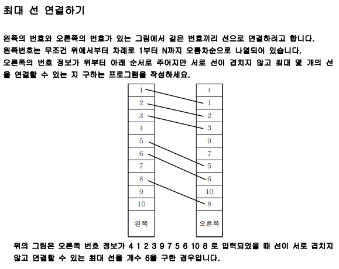

# 최장 증가 부분 수열

### 1. LIS(Longest Increasing Subsequence) 시간 복잡도(O(N^2))

- 가장 긴 증가하는 부분 수열을 구하는 것이다
  - 어떠한 수열이 주어질 때, 그 수열에서 일부 원소를 뽑아내어 새로 만든 수열을 '부분 수열'이라고 하며, 이 수열이 오름차순을 유지하면 '증가하는 부분 수열'이 되는 것이다.


✔예시 1) 시간복잡도(O(N ^ 2))

```python
'''
N개의 자연수로 이루어진 수열이 주어졌을 때, 그 중에서 가장 길게 증가하는(작은 수에서 큰 
수로) 원소들의 집합을 찾는 프로그램을 작성하라. 예를 들어, 원소가 2, 7, 5, 8, 6, 4, 7, 
12, 3 이면 가장 길게 증가하도록 원소들을 차례대로 뽑아내면 2, 5, 6, 7, 12를 뽑아내어 길
이가 5인 최대 부분 증가수열을 만들 수 있다.

▣ 입력설명
첫째 줄은 입력되는 데이터의 수 N(2≤N≤1,000, 자연수)를 의미하고, 
둘째 줄은 N개의 입력데이터들이 주어진다. 

▣ 출력설명
첫 번째 줄에 부분증가수열의 최대 길이를 출력한다.

▣ 입력예제 1 
8
5 3 7 8 6 2 9 4

▣ 출력예제 1
4
'''

N = int(input())
li = list(map(int, input().split()))
dp = [1] * N    # 증가하는 부분 수열 중 가장 긴 값을 저장할 공간
for i in range(1, N):   # 비교가 가능한 인덱스 1부터 순차적으로 진행
    maxV = 0    # 가장 큰값을 받을 변수
    flag = False    # 신호
    for j in range(i - 1, -1, -1):  # 그 이전의 값들을 비교진행
        if li[j] < li[i] and dp[j] > maxV:  # 자기보다 작으면서 dp의 값이 가장 큰 것을 찾음
            maxV = dp[j]
            flag = True # 신호 주기
    if flag:    # 그러한 값이 있으면 그 값에서 1증가
        dp[i] = maxV + 1
print(max(dp))
```


✔응용 예시2)



> LIS를 구하라는 설명만 다를 뿐 똑같은 방식으로 해결이 가능하다

```python
'''
결국엔 가장 긴 증가하는 수열을 구하는 것이 문제의 핵심!
증가하는 방향으로 찾아야 선이 꼬이지 않게 된다.
'''
N = int(input())
arr = list(map(int, input().split()))
dp = [1] * N
for i in range(1, N):
    maxV = 0
    flag = False
    for j in range(i - 1, -1, -1):
        if arr[j] < arr[i] and dp[j] > maxV:
            maxV = dp[j]
            flag = True
    if flag:
        dp[i] = maxV + 1
# print(dp)
print(max(dp))
```


✔응용 예시3)


> 밑면과 벽돌의 무게라는 두 개의 조건 사항을 확인해야 하는데, 밑면을 미리 오름차순 시키면 무게의 조건만 확인하면 되므로 LIS와 결국 같은 문제이다.

```python
'''
위에 탑을 쌓을 조건
1. 아래 탑의 면적이 더 넓어야 한다.
2. 아래 쪽이 더 무거워야한다.
결국 둘다 커야 한다.
그리디로는 불가능(두 변수가 존재해서 반례가 발생)
면적이 엄청 넓더라도 그 무게가 작다면 담을 수 있는 게 적음

직관적으로 떠오르는 방법
면적과 무게에 따라 정렬을 시킨 후
전부 확인해 나가는 방법

다시 생각해봤을 때 면적을 정리시키면 더이상 신경 쓰지 않고 무게에만 집중하면 된다
무게를 증가하는 수열로 만들어 가장 높이가 큰것들이 이어지도록 설정
'''
N = int(input())
arr = [list(map(int, input().split())) for _ in range(N)]
dp = [0] * N
arr.sort(key=lambda x: (x[0], x[1]), reverse=True)
dp[0] = arr[0][1]
# print(arr)
# print(dp)

for i in range(1, N):
    maxV = 0
    flag = False
    for j in range(i - 1, -1, -1):
        if arr[j][2] > arr[i][2] and dp[j] > maxV:
            maxV = dp[j]
            flag = True
    if flag:
        dp[i] = maxV + arr[i][1]
    else:
        dp[i] = arr[i][1]
# print(arr)
# print(dp)
print(max(dp))
```


### 2. LIS 시간 복잡도(O(nlogn))

- stack의 개념을 통해서 증가하는 부분 수열을 쌓아나간다
- 각 숫자를 비교하면서 부분 수열을 업데이트 해주면서 진행한다
- 나중에 증가하는 수열을 역추적할 때에는 dp를 활용해서 추출해야한다.

```python
import sys
from collections import deque
input = sys.stdin.readline

'''
최장 증가 부분 수열을 stack을 통해 쌓아나간다.
큰 수가 오면 바로 append를 하면 되지만,
작은 수가 오는 경우 stack 내에서 가장 근접한 값 중 큰 값을 해당 값으로 치환시킨다.
'''


def LIS(n): # n: 인덱스 정보
    num = arr[n]    # 해당 인덱스의 값
    if num > stack[-1]: # 현재 증가하는 부분 수열의 가장 큰 값보다 크면 추가할 수 있으므로 append진행
        stack.append(num)
        dp[n] = len(stack)
    else: # 값이 작은 경우 수열 내부에서 최적화 진행, 증가하는 수열 중에서도 작은 값들의 모임이 최적화 된 것임
        binary_search(0, len(stack) - 1, num, n)

def binary_search(left, right, value, idx):  # 이분 탐색 함수
    '''
    :param left: 첫 번째 인덱스 정보
    :param right: 마지막 인덱스 정보
    :param value: 비교하고자 하는 값
    '''
    while left <= right:    # 어긋나게 되면 더 이상 찾을 정보가 없다는 의미
        mid = (left + right) // 2
        if stack[mid] == value:
            dp[idx] = mid # 값이 같다면 최장 증가 길이의 값도 같게 된다. (stack의 길이가 증가 길이 이기 때문에)
            break
        elif stack[mid] < value:
            left = mid + 1
        else:
            right = mid - 1

    if dp[idx] == 1 and stack[left] > value:
        stack[left] = value
        dp[idx] = left + 1
    elif dp[idx] == 1 and stack[left] < value:
        dp[idx] = right + 2

if __name__=="__main__":
    N = int(input())
    arr = list(map(int, input().split()))
    dp = [1] * N    # 최대 길이의 값을 저장할 공간
    stack = []
    for i in range(N):
        '''
        stack에 쌓아나가면서 증가하는 부분 수열을 만들어나간다.
        '''
        if stack:   # 값이 있을 경우 비교하면서 계속 진행
            LIS(i)
        else:   # 값이 없을 경우 그냥 append
            stack.append(arr[i])
    # print(arr)
    # print(dp)
    # print(stack)
    max_length = len(stack)
    print(max_length)
    result = deque()    # 부분 수열을 담을 공간
    value = float('inf')
    for j in range(N - 1, -1, -1):  # 가장 끝 부분부터 순회하면서 값 넣어주기
        if dp[j] == max_length and arr[j] < value:
            max_length -= 1
            value = arr[j]
            result.appendleft(arr[j])
            if max_length == 0:
                break
    print(*result)
```

