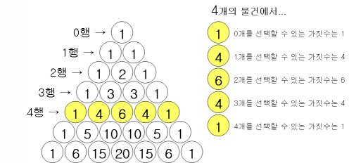

# 파스칼 삼각형

### ✔ 파스칼 삼각형이란?

파스칼의 삼각형은 수학에서 이항계수(서로 다른 몇 개의 물건 중에서 순서없이 물건을 선택할 수 있는 경우의 수)를 삼각형 모양의 기하학적 형태로 배열한 것입니다.
이것은 블레즈 파스칼에 의해 이름 붙여졌으나 이미 수세기 전에 다른 사람들에게서 연구된 것입니다.
파스칼의 삼각형은 그 안에 수학적으로 흥미 있는 현상들이 많이 숨어 있습니다.

### ✔ 파스칼의 삼각형 만드는 법

위쪽의 양쪽 사선 방향에서 내려받은 숫자를 서로 더하면 파스칼의 삼각형이 만들어 집니다.
삼각형의 양쪽 빗면의 숫자는 '1'로 합니다.

### ✔ 파스칼 삼각형의 특징

- 각 행의 합은 2의 거듭제곱과 같다.

- 숫자들의 의미 = 위쪽 수열의 합과 같다.

- 피보나치 수열이 존재

- 0행의 수열 = 0개의 물건 중에서 순서 없이 물건을 뽑는 조합의 가짓수
  
- 1행의 수열 = 1개의 물건 중에서 순서 없이 물건을 뽑는 조합의 가짓수
  
- 2행의 수열 = 2개의 물건(A, B) 중에서 순서 없이 물건을 뽑는 조합의 가짓수
  
- 4행의 수열 = 4개의 물건(A, B, C, D) 중에서 순서 없이 물건을 뽑는 조합의 가짓수
  